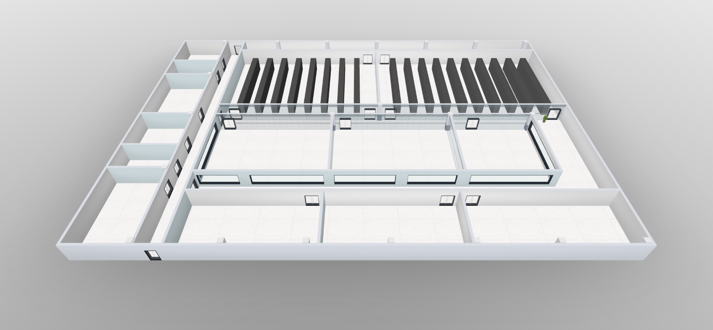
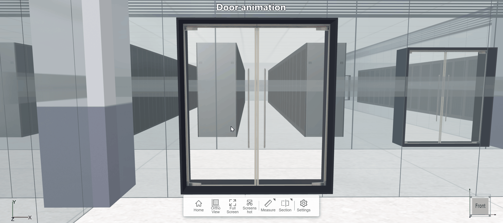

## server-room
Interactive Datacenter Visualization & Management with Three.js / WebGL.

3D DC Insight is a browser-based datacenter management platform built on Three.js and WebGL. It transforms floor-plans, racks, servers and sensors into a real-time, interactive 3D world where operators can see, customize and act at a glance.

## Project setup
```
npm install
```

### Compiles and hot-reloads for development
```
npm start
```

### Features
- Server room home view

- 3D overview

- View Racks

- Door animation

- Rack animation

- Immersive 3D View
- Drag-and-Drop Builder
- Live Monitoring
- Custom Alerts
- Asset Editor
- Export & Share

  
